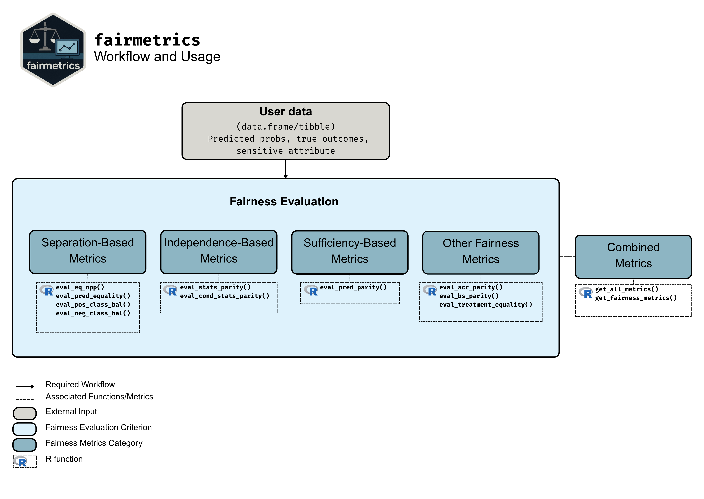

# Summary

<!--- 
Rewritten by Jesse
--->
Fairness is a growing area of machine learning (ML) that focuses on ensuring models do not produce systematically biased outcomes for certain groups, particularly those defined by protected attributes such as race, gender, or age. Evaluating fairness is a critical aspect of model development, as biased models can perpetuate or exacerbate existing social inequalities.  The {fairmetrics} R package offers a user-friendly framework for rigorously evaluating numerous group-based fairness criteria, including metrics based on independence (e.g., statistical parity), separation (e.g., equalized odds), and sufficiency (e.g., predictive parity). These criteria assess whether a model is equally accurate or well-calibrated across predefined groups so that appropriate bias mitigation strategies can be implemented. {fairmetrics} provides both point and interval estimates for multiple metrics through convenient wrapper functions, and includes example an dataset derived from the Medical Information Mart for Intensive Care, version II (MIMIC-II) database [@goldberger2000physiobank; @raffa2016clinical].


# Statement of Need

<!---
Jianhui - this is too similar to the original paper still and I suggest we emphasize that the package isn't restricted to biomedical data.  We can of course use it as an example but this isn't the need for the package. Can you rewrite this to just be about the general use of fairness?  i.e., point 1 - ml increasing integrated into different areas, point 2 - give a few examples, point 3 - need for the package in light of other work.  I don't think interpetable is the correct word here, the key difference is allowing for uncertainty quantification, we also provide ratio + difference estimates, i dont think R fairness package does, I would emphasize   
--->

Machine learning (ML) offers significant potential for predictive modelling in biomedical research [@rajpurkarAIHealthMedicine2022]. Despite its promise, there is substantial evidence that, without appropriate forethought and planning, ML models can introduce or exacerbate health inequities by making less accurate decisions for certain groups or individuals [@grote2022enabling]. While existing software can compute fairness metrics, none provide out-of-the-box statistical inference, leaving practitioners without guidance on the uncertainty around those metrics. As ML becomes increasingly embedded in healthcare systems, ensuring equitable model performance across diverse populations is essential[@Gao_Chou_McCaw_Thurston_Varghese_Hong_Gronsbell_2024]. The {fairmetrics} R package fills this gap by offering a suite of popular group-fairness metrics along with bootstrap-based confidence intervals, enabling more rigorous and interpretable assessments of fairness in biomedical ML.

# Fairness Criteria

<!---
This section needs to be cleaned up for clarity - see comments below.
--->

Group fairness criteria are typically classified into three main categories: independence, separation, and sufficiency [@barocas2023fairness; @Berk_Heidari_Jabbari_Kearns_Roth_2018; @Castelnovo_Crupi_Greco_Regoli_Penco_Cosentini_2022]. The {fairmetrics} package computes a range of group fairness metrics together with bootstrap-based confidence intervals for uncertainty quantification.  The metrics implemented in the package are briefly described below.


<!---
1. Jianhui - The scope of the package is not defined in the above paragprah so one would not understand the definitons below (i.e., "positive classification" is never defined).  Specifically, you need to say you consider binary classification and a binary protected attribute - I do not believe your package handles more than.  Explain why this is done and then update the definitions below to reflect this. 

2. Jianhui - why do you use bootstrap for this package rather than IF?  Is it because you don't have IF for all metrics?

3. Jianhui - please update the initial sentences describing the 3 categories to be more intuitive, akin to what we have in the paper.  
--->

## Independence

-   **Statistical Parity:** Compares the overall rate of positive predictions between groups, irrespective of the true outcome.

-   **Conditional Statistical Parity:** Restricts the comparison of positive prediction rates to a specific subgroup (e.g., within a hospital unit or age bracket), offering a more context-specific fairness assessment.

<!---
Use consistent language throughout - alternating between checks/compares/focuses/assess/measure/etc is confusing as all functions do the same thing.  Suggest use "Compares" for all. 

Ben Response: Rewritten to use "Compares".
--->

## Separation

-   **Equal Opportunity:**  Compares disparities in false negative rates between two groups, quantifying any difference in missed positive cases.

<!---
Do you need the acronyms for FNR and FPR? If you don't use them later, they don't need to be defined.

Ben Response: FPR is used. FNR is not. Removed FNR. 
--->
-   **Predictive Equality:** Compares false positive rates (FPR) between groups, ensuring that no group is disproportionately flagged as positive when the true outcome is negative.

-   **Positive Class Balance:**  Compares the distribution of predicted probabilities among individuals whose true outcome is positive between groups, ensuring that the model does not favor one group over another in its positive predictions.

-   **Negative Class Balance:** Compares the distribution of predicted probabilities among individuals whose true outcome is negative between groups, ensuring that the model does not favor one group over another in its negative predictions.

## Sufficiency

-   **Predictive Parity:** Compares positive predictive values across groups, assessing whether the precision of positive predictions is equivalent.

## Other Criteria

-   **Brier Score Parity:** Compares the Brier score—the mean squared error of probabilistic predictions—is similar across groups, indicating comparable calibration.

-   **Accuracy Parity:** Compares the overall accuracy of a predictive model is equivalent across different groups.

-   **Treatment Equality:** Compares the ratio of false negatives to false positives across groups, ensuring the balance of missed detections versus false alarms is consistent.

# Evaluating Fairness Criteria

<!--
1. Ben - The package doesn't require data splitting, some people may want to use the package and incorporate CV within training.  Also, sometimes people evaluate fairness metrics on validation data. So suggest you simplify text + figure. Just start with the input.  Also, it doesn't seem like multiple should be a separate node?  doesnt it just include all the 4 boxes (sep, suff, ind, other)? can this be depicted? Also suggest you make the names more descriptive "Separation-based Metrics", "Independence-based Metrics", etc.

Ben Response: Created 3 different figures to review. I think v3 is the best. Please critique if there are any issues.
--->
The primary input to the {fairmetrics} package is a data frame or tibble which containing the model's predictions, true outcomes, and the protected attribute in question. \hyperref[workflow]{Figure ~\ref*{workflow}} shows the workflow for using {fairmetrics}. It is possible to evaluate a model for a specific or multiple group fairness metrics. 



<!---
Previously edited by Jesse, now edited by Ben
--->
A simple example of how to use the {fairmetrics} package is shown below. The example makes use of the `mimic_preprocessed` dataset, a pre-processed version of the the Indwelling Arterial Catheter (IAC) Clinical Dataset, from MIMIC-II clinical database^[The raw version of this data is made available by PhysioNet [@goldberger2000physiobank] and can be accessed in {fairmetrics} package by loading the `mimic` dataset.] [@raffa2016clinical; @raffa2016data]. This dataset consists of 1776 hemodynamically stable patients with resperatory failure, and includes demographic information (patient age and gender), vital signs, laboratory results, whether an IAC was used, and a binary outcome indicating wheter the patient died within 28 days of admission.

While the choice of fairness metric used is context dependent, we show all metrics available with the `get_fairness_metrics()` function. In this example, we evaluate the model's fairness with respect to the protected attribute `gender`. For conditional statistical parity, we condition  being `>=60` years old. The model is trained on a subset of the data, and predictions are made on a test set. 
<!---
1. Ben - need to add detail on what the detail is in the above paragraph. What does the data contaon, where did it come from, what is the sample size, etc.   

Ben Response: Done.

2. Ben - suggest you show more of the functions in the package - say that, while the choice of metric is context dependent, we show all metrics to show the full range of the package. Also include interpretation of the various results.  Simple way to do this is show, the multiple output then show an example of one of the separation-based criterion or other to show users they can specify what they want.  

Ben Response: Please see below for the examples and review.
---->

```r
library(fairmetrics)
library(dplyr)
library(magrittr)
library(randomForest)

# Load the example dataset
data("mimic_preprocessed")  

# Split the data into training and test sets
train_data <- mimic_preprocessed %>%
  dplyr::filter(dplyr::row_number() <= 700)

test_data <- mimic_preprocessed %>%
  dplyr::mutate(gender = ifelse(gender_num == 1, "Male", "Female")) %>%
  dplyr::filter(dplyr::row_number() > 700)

# Train a random forest model
rf_model <- randomForest::randomForest(
  factor(day_28_flg) ~ ., 
  data = train_data, 
  ntree = 1000
  )
  
# Make predictions on the test set
test_data$pred <- predict(rf_model, newdata = test_data, type = "prob")

# Evaluate predictive equality
# (Setting message=FALSE to avoid cluttering the output)

get_fairness_metrics(
 data = test_data,
 outcome = "day_28_flg",
 group = "gender",
 group2 = "age",
 condition = ">=60",
 probs = "pred",
 cutoff = 0.41
)

#>                                       Metric GroupFemale GroupMale Difference    95% Diff CI Ratio 95% Ratio CI
#> 1                         Statistical Parity        0.17      0.08       0.09   [0.05, 0.13]  2.12 [1.48, 3.05]
#> 2  Conditional Statistical Parity (age >=60)        0.34      0.21       0.13   [0.05, 0.21]  1.62 [1.18, 2.22]
#> 3                          Equal Opportunity        0.38      0.62      -0.24 [-0.39, -0.09]  0.61 [0.44, 0.86]
#> 4                        Predictive Equality        0.08      0.03       0.05   [0.02, 0.08]  2.67  [1.39, 5.1]
#> 5                 Balance for Positive Class        0.46      0.37       0.09   [0.04, 0.14]  1.24 [1.09, 1.41]
#> 6                 Balance for Negative Class        0.15      0.10       0.05   [0.03, 0.07]  1.50 [1.29, 1.74]
#> 7                          Predictive Parity        0.62      0.66      -0.04  [-0.21, 0.13]  0.94 [0.72, 1.23]
#> 8                         Brier Score Parity        0.09      0.08       0.01  [-0.01, 0.03]  1.12 [0.89, 1.43]
#> 9                    Overall Accuracy Parity        0.87      0.88      -0.01  [-0.05, 0.03]  0.99 [0.94, 1.04]
#> 10                        Treatment Equality        1.03      3.24      -2.21 [-4.35, -0.07]  0.32 [0.15, 0.68]
```

Among the fairness metrics calculated, metrics whose difference confidence intervals cross zero and whose ratio confidence intervals cross one indicate no significant difference between the groups. In this example, the statistical parity, conditional statistical pairty, equal opportunity, predictive equality, positive class balance, negative class balance, and treatment equaltiy metrics show a significant differences. While, the predictive parity, Brier score parity, and overall accuracy parity metrics do not show significant differences between the groups. 

Should the user wish to calculate an individual metric, it is possible to use any of the `eval_*` functions. For example, to calculate the equal opportunity metric, the user can use the `eval_equal_opportunity()` function.

```r
eval_eq_opp(
  data = test_data,
  outcome = "day_28_flg",
  group = "gender",
  probs = "pred",
  cutoff = 0.41
)

#>There is evidence that model does not satisfy equal opportunity.
#>  Metric GroupFemale GroupMale Difference    95% Diff CI Ratio 95% Ratio CI
#>1    FNR        0.38      0.62      -0.24 [-0.39, -0.09]  0.61 [0.44, 0.85]
```

For more traditional fairness metrics, such as the True Positive Rate (TPR), False Positive Rate (FPR), Positive Predictive Value (PPV), Negative Predictive Value (NPV), and others, the `get_all_metrics()` function can be used. This function returns a data frame with the metrics calculated for each group.

```r
get_all_metrics(
  dat = test_data,
  outcome = "day_28_flg",
  group = "gender",
  probs = "pred",
  cutoff = 0.41
)

#>         Metric Group Female Group Male
#> 1           TPR         0.62       0.38
#> 2           FPR         0.08       0.03
#> 3           PPR         0.17       0.08
#> 4           PPV         0.62       0.66
#> 5           NPV         0.92       0.90
#> 6           ACC         0.87       0.88
#> 7   Brier Score         0.09       0.08
#> 8   FN/FP Ratio         1.03       3.24
#> 9 Avg Pred Prob         0.21       0.14
```

# Related Work

<!---
## Both - you are missing this one: https://mlr3fairness.mlr-org.com
## Do these metrics give difference and ratio based criteria? Are there any other differences? 

Ben Response: Added mlr3fairness package updated the differences.

For comparison: 

- {fairness}- does not give difference or ratio based criteria, only point estimates. The package also produces plots which {fairmetrics} does not (not in our scope).
- {fairmodels}- does give ratio criteria but not GROUP ratio based criteria, only overall ratio. The package also produces plots which {fairmetrics} does not (not in our scope). No difference based criteria.
- Same with {mlr3fairness} - does not give difference or ratio based criteria, only point estimates. The package also produces plots which {fairmetrics} does not (not in our scope).


(I would also add that the {fairmodels} has added complexity required to using it, and {mlr3fairness} packages are designed for use with the mlr3 framework, which is not as widely adopted in the R community. This could be a "skill issue" on my part. However I don't think such a comment would be appropriate for the paper.)

--->
Other R packages similar to {fairmetrics} include {fairness}[@fairness_package], {fairmodels} [@wisniewski2022fairmodels] and {mlr3fairness}[mlr3fairness_package]. The differences between {fairmetrics} and these other packages is twofold. The primary difference between is that {fairmetrics} calculates the ratio and difference between group fairness criterion and allows estimated confidence intervals of fairness metrics via bootstrap - allowing for more meaningful inferences about the fairness metrics calculated. Additionally, in contrast to the {fairmodels}, {fairness} and {mlr3fairness} packages, the {fairmetrics} package does not posses any external dependencies and has a lower memory footprint, resulting in an environment agnostic tool that can be used with modest hardware and older systems. \hyperref[tab:memory_dep_usage]{Table~\ref*{tab:memory_dep_usage}} shows the comparison of memory used and dependencies required when loading each library. 

\begin{table}[ht]
\centering
\begin{tabular}{l r r}
\hline
\textbf{Package} & \textbf{Memory (MB)} & \textbf{Dependencies} \\
\hline
fairmodels  & 17.02  & 29 \\
fairness    & 117.61 & 141\\
fairmodels  & 58.11  & 45 \\
fairmetrics & 0.05   & 0  \\
\hline
\end{tabular}
\caption{Memory usage and dependencies of {fairmetrics} vs similar packages (MB)}
\label{tab:memory_dep_usage}
\end{table}

For python users, the {fairlearn} library [@fairlearn_paper] provides a broader set of fairness metrics and algorithms. The {fairmetrics} package is designed for seemless integration with R workflows, making it a more convenient choice for R-based ML applications.

# Licensing and Availability

The {fairmetrics} package is under the MIT license. It is available on CRAN and can be installed by using `install.packages("fairmetrics")`. A more in-depth tutorial can be accessed at: https://jianhuig.github.io/fairmetrics/articles/fairmetrics.html. All code is open-source and hosted on
GitHub. All bugs and inquiries can be reported at https://github.com/jianhuig/fairmetrics/issues/.


# References
