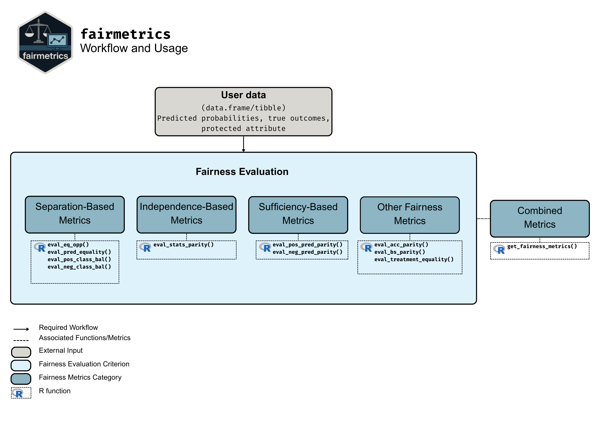

# Summary

Fairness is a growing area of machine learning (ML) that focuses on ensuring models do not produce systematically biased outcomes for specific groups, particularly those defined by protected attributes such as race, gender, or age. Evaluating fairness is a critical aspect of ML model development, as biased models can perpetuate structural inequalities.  The {fairmetrics} R package offers a user-friendly framework for rigorously evaluating numerous group-based fairness criteria, including metrics based on independence (e.g., statistical parity), separation (e.g., equalized odds), and sufficiency (e.g., predictive parity). Group-based fairness criteria assess whether a model is equally accurate or well-calibrated across a set of predefined groups so that appropriate bias mitigation strategies can be implemented. {fairmetrics} provides both point and interval estimates for multiple metrics through a convenient wrapper function and includes an example dataset derived from the Medical Information Mart for Intensive Care, version II (MIMIC-II) database [@goldberger2000physiobank; @raffa2016clinical].


# Statement of Need

ML models are increasingly integrated into high-stakes domains to support decision making that significantly impacts individuals and society more broadly, including criminal justice, healthcare, finance, employment, and education [@mehrabi_survey_21].  Mounting evidence suggest that these models often exhibit bias across groups defined by protected attributes. For example, within criminal justice, the Correctional Offender Management Profiling for Alternative Sanctions (COMPAS) software, a tool used by U.S. courts to evaluate the risk of defendants becoming recidivists, was found to incorrectly classify Black defendants as high-risk at nearly twice the rate of white defendants [@mattuMachineBias].  This bias impacted Black defendants by potentially leading to harsher bail decisions, longer sentences, and reduced parole opportunities compared to white defendants with similar risk profiles. Similarly, within healthcare, a commercial risk-prediction algorithm deployed in the U.S. to identify patients with complex health needs for high-risk care management programs was shown to be significantly less calibrated for Black patients relative to white patients [@obermeyerDissectingRacialBias2019]. This caused Black patients with equivalent health conditions to be under-referred for essential care services compared to white patients.  These examples illustrate that there is an urgent need for practitioners and researchers to ensure that ML models support fair decision making before they are deployed in real-world applications.

While existing software can compute group fairness criteria, they only provide point estimates and/or visualizations without quantifying the uncertainty around the criteria. This limitation prevents users from determining whether observed disparities between groups are statistically significant or merely the result of random variation due to finite sample size, potentially leading to incorrect conclusions about fairness violations. The {fairmetrics} R package addresses this gap by providing bootstrap-based confidence intervals (CIs) for both difference-based and ratio-based group fairness metrics, empowering users to make statistically grounded decisions about the fairness of their models, which is inconsistently done in practice. 

# Scope

The `{fairmetrics}` package is designed to evaluate group fairness in the setting of binary classification with a binary protected attribute. This restriction reflects standard practice in the fairness literature and is motivated by several considerations. First, binary classification remains prevalent in many high-stakes applications, such as loan approval, hiring decisions, and disease screening, where outcomes are typically framed as accept/reject or positive/negative [@mehrabi_survey_21]. Second, group fairness is the most widely used framework for binary classification tasks [@mehrabi_survey_21]. Third, when protected attributes have more than two categories, there is no clear consensus on how to evaluate group fairness [@lum_debias_22]. This focus enables {fairmetrics} to provide statistically grounded uncertainty quantification for group fairness metrics commonly applied in binary classification tasks across diverse application domains.

# Fairness Criteria

Group fairness criteria are primarily classified into three main categories: independence, separation, and sufficiency [@barocas2023fairness; @Berk_Heidari_Jabbari_Kearns_Roth_2018; @Castelnovo_Crupi_Greco_Regoli_Penco_Cosentini_2022; @Gao_Chou_McCaw_Thurston_Varghese_Hong_Gronsbell_2024]. Independence requires that the model's classifications be statistically independent of the protected attribute, meaning the likelihood of receiving a positive prediction is the same across protected groups. Separation requires independence between the classifications and the protected attribute conditional on the true outcome, so that the probability of a positive prediction is equal across protected groups within the positive (or negative) outcome class. Sufficiency requires independence between the outcome and the protected attribute conditional on the prediction, implying that once the model's prediction is known, the protected attribute provides no additional information about the true outcome.  Below we summarize the fairness metrics that are available within the {fairmetrics} package.  

## Independence

-   **Statistical Parity:** Compares the overall rate of positive predictions between groups.

-   **Conditional Statistical Parity:** Restricts the comparison of positive prediction rates to a specific subgroup (e.g., within a hospital unit or age bracket), offering a more context-specific fairness assessment.

## Separation

-   **Equal Opportunity:**  Compares disparities in the false negative rates between groups, quantifying differences in the likelihood of missing positive outcomes.

-   **Predictive Equality:** Compares the false positive rates (FPR) between groups, quantifying differences in the likelihood of incorrectly labeling negative outcomes as positive.

-   **Balance for Positive Class:**  Compares the average of the predicted probabilities among individuals whose true outcome is positive across groups.

-   **Balance for Negative Class:** Compares the average of the predicted probabilities among individuals whose true outcome is negative across groups.

## Sufficiency

-   **Positive Predictive Parity:** Compares the positive predictive values across groups, assessing differences in the precision of positive predictions.

-   **Negative Predictive Parity:** Compares the negative predictive values across groups, assessing differences in the precision of negative predictions.

## Other Criteria

-   **Brier Score Parity:** Compares the Brier score (i.e., the mean squared error of the predicted probabilities) across groups, evaluating differences in calibration. 

-   **Accuracy Parity:** Compares the overall accuracy of a predictive model across groups.

-   **Treatment Equality:** Compares the ratio of false negatives to false positives across groups, evaluating whether the trade-off between missed detections of positive outcomes and false alarms of negative outcomes is balanced.

# Evaluating Fairness Criteria

The input to the {fairmetrics} package is a data frame or tibble containing the model's predicted probabilities, the true outcomes, and the protected attribute of interest. \hyperref[workflow]{Figure ~\ref*{workflow}} shows the workflow for using {fairmetrics}. Users can evaluate a model for a specific criterion or multiple group fairness criteria using the combined metrics function. 



A simple example of how to use the {fairmetrics} package is illustrated below. The example makes use of the `mimic_preprocessed` dataset, a pre-processed version of the the Indwelling Arterial Catheter (IAC) Clinical Dataset, from the MIMIC-II clinical database^[The raw version of this data is made available by PhysioNet [@goldberger2000physiobank] and can be accessed in the {fairmetrics} package by loading the `mimic` dataset.] [@raffa2016clinical; @raffa2016data]. The dataset consists of 1,776 hemodynamically stable patients with respiratory failure and includes demographic information (patient age and gender), vital signs, laboratory results, whether an IAC was used, and a binary outcome indicating whether the patient died within 28 days of hospital admission.

While the choice of fairness criteria used is context dependent, we show all criteria available with the `get_fairness_metrics()` function for the purposes of illustration. In this example, we evaluate the model's fairness with respect to the protected attribute `gender`. For conditional statistical parity, we condition on patients older than 60 years old. The model is trained on a subset of the data and the predictions are made and evaluated on a test set.  The `get_fairness_metrics()` function outputs difference and ratio-based metrics as well as their corresponding confidence intervals.  A statistically significant difference across groups at a given level of significance is indicated when the confidence interval for a difference-based metric does not include zero or when the interval for a ratio-based metric does not include one.

```r
library(fairmetrics)
library(dplyr)
library(magrittr)
library(randomForest)

# Load the example dataset
data("mimic_preprocessed")  

# Split the data into training and test sets
train_data <- mimic_preprocessed %>%
  dplyr::filter(dplyr::row_number() <= 700)

test_data <- mimic_preprocessed %>%
  dplyr::mutate(gender = ifelse(gender_num == 1, "Male", "Female")) %>%
  dplyr::filter(dplyr::row_number() > 700)

# Train a random forest model
rf_model <- randomForest::randomForest(
  factor(day_28_flg) ~ ., 
  data = train_data, 
  ntree = 1000
  )
  
# Make predictions on the test set
test_data$pred <- predict(rf_model, newdata = test_data, type = "prob")[,2]


# Get fairness metrics
# Setting alpha=0.05 for 95% confidence intervals
get_fairness_metrics(
 data = test_data,
 outcome = "day_28_flg",
 group = "gender",
 group2 = "age",
 condition = ">=60",
 probs = "pred",
 cutoff = 0.41, 
 alpha = 0.05
)

#>                  Metric                          Full Metric Name GroupFemale
#> 1                   PPR                        Statistical Parity        0.17
#> 2                   PPR Conditional Statistical Parity (age >=60)        0.34
#> 3                   FNR                         Equal Opportunity        0.36
#> 4                   FPR                       Predictive Equality        0.07
#> 5  Avg. Predicted Prob.                Balance for Positive Class        0.46
#> 6  Avg. Predicted Prob.                Balance for Negative Class        0.15
#> 7                   PPV                Positive Predictive Parity        0.64
#> 8                   NPV                Negative Predictive Parity        0.93
#> 9           Brier Score                        Brier Score Parity        0.09
#> 10             Accuracy                   Overall Accuracy Parity        0.88
#> 11          FN/FP Ratio                        Treatment Equality        1.00
#>    GroupMale Difference    95% Diff CI Ratio 95% Ratio CI
#> 1       0.09       0.08   [0.04, 0.12]  1.89 [1.34, 2.67]
#> 2       0.24       0.10   [0.02, 0.18]  1.42 [1.05, 1.91]
#> 3       0.58      -0.22 [-0.37, -0.07]  0.62 [0.43, 0.89]
#> 4       0.03       0.04   [0.01, 0.07]  2.33 [1.19, 4.56]
#> 5       0.37       0.09   [0.04, 0.14]  1.24 [1.09, 1.42]
#> 6       0.10       0.05   [0.03, 0.07]  1.50 [1.29, 1.75]
#> 7       0.69      -0.05  [-0.21, 0.11]  0.93 [0.72, 1.19]
#> 8       0.91       0.02  [-0.15, 0.19]  1.02 [0.79, 1.32]
#> 9       0.08       0.01  [-0.01, 0.03]  1.12 [0.88, 1.43]
#> 10      0.89      -0.01  [-0.05, 0.03]  0.99 [0.95, 1.03]
#> 11      3.00      -2.00  [-4.11, 0.11]  0.33 [0.15, 0.73]

```


Should the user wish to calculate an individual criteria, it is possible to use any of the `eval_*` functions. For example, to calculate equal opportunity, the user can call the `eval_equal_opportunity()` function.

```r
eval_eq_opp(
  data = test_data,
  outcome = "day_28_flg",
  group = "gender",
  probs = "pred",
  confint = TRUE,
  cutoff = 0.41,
  alpha = 0.05
)

#> There is evidence that model does not satisfy equal opportunity.
#>   Metric GroupFemale GroupMale Difference    95% Diff CI Ratio 95% Ratio CI
#> 1    FNR        0.36      0.58      -0.22 [-0.37, -0.07]  0.62 [0.43, 0.89]
```


# Related Work

Other R packages similar to {fairmetrics} include {fairness} [@fairness_package], {fairmodels} [@wisniewski2022fairmodels] and {mlr3fairness} [@mlr3fairness_package]. The differences between {fairmetrics} and these other packages is twofold. The primary difference between is that {fairmetrics} calculates the ratio and difference between group fairness criterion and their corresponding confidence intervals of fairness metrics via bootstrap, allowing for more meaningful inferences about the fairness criteria. Additionally, in contrast to the {fairmodels}, {fairness} and {mlr3fairness} packages, the {fairmetrics} package does not posses any external dependencies and has a lower memory footprint, resulting in an environment agnostic tool that can be used with modest hardware and older systems. \hyperref[tab:memory_dep_usage]{Table~\ref*{tab:memory_dep_usage}} shows the comparison of memory used and dependencies required when loading each library. 

\begin{table}[ht]
\centering
\begin{tabular}{l r r}
\hline
\textbf{Package} & \textbf{Memory (MB)} & \textbf{Dependencies} \\
\hline
fairmodels  & 17.02  & 29 \\
fairness    & 117.61 & 141\\
fairmodels  & 58.11  & 45 \\
fairmetrics & 0.05   & 0  \\
\hline
\end{tabular}
\caption{Memory usage (in MB) and dependencies of {fairmetrics} vs similar packages.}
\label{tab:memory_dep_usage}
\end{table}

For python users, the {fairlearn} library [@fairlearn_paper] provides additional fairness metrics and algorithms. The {fairmetrics} package is designed for seemless integration with R workflows, making it a more convenient choice for R-based ML applications.

# Licensing and Availability

The {fairmetrics} package is under the MIT license. It is available on CRAN and can be installed by using `install.packages("fairmetrics")`. A more in-depth tutorial can be accessed at: https://jianhuig.github.io/fairmetrics/articles/fairmetrics.html. All code is open-source and hosted on
GitHub. All bugs and inquiries can be reported at https://github.com/jianhuig/fairmetrics/issues/.


# References
